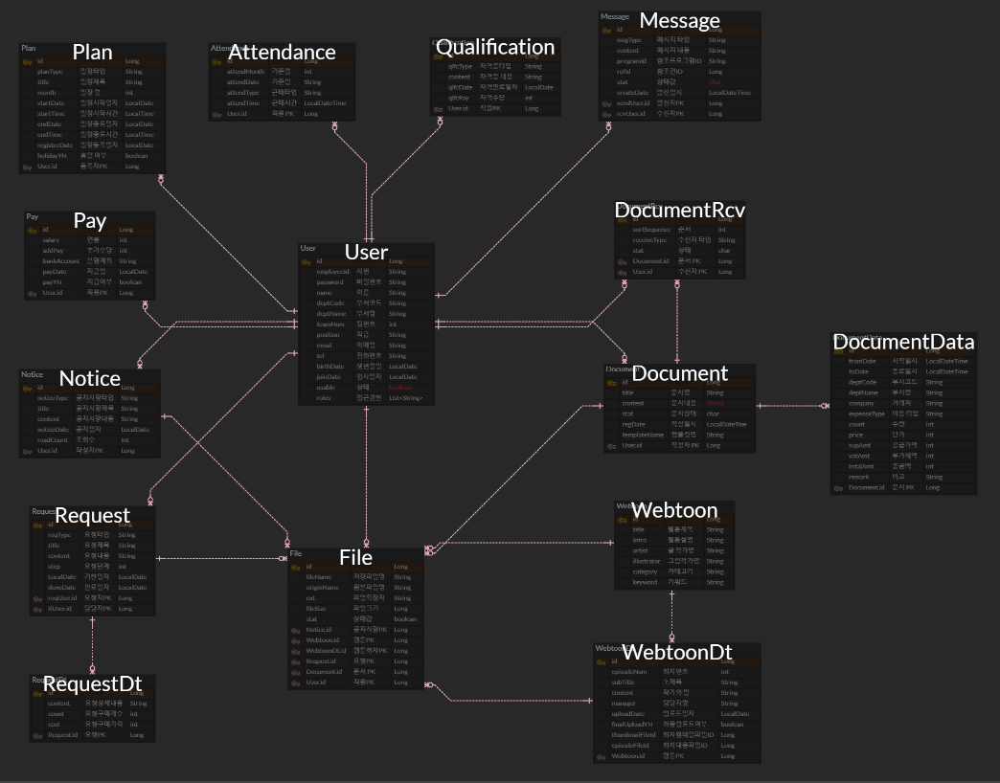

# 피어나툰 ERP 구축 프로젝트

 

## 🐈‍⬛ GitHub

[https://github.com/GomSon-E/webtoon-backend-new](https://github.com/GomSon-E/webtoon-backend-new)

[https://github.com/webtoon-erp/front](https://github.com/webtoon-erp/front)

 

## 📢 Introduction

### Project

- 가상의 웹툰 회사 ‘피어나툰’ ERP 구축 프로젝트
- 쉽고 편리하며 Paperless 캠페인을 지향하는 ERP 구축

### Background

- 업무 효율 향상을 위한 체계적인 관리 필요성 강조
- 종이 문서의 한계와 문제점을 해결하기 위한 디지털화 필요성 인식
- 사용자 친화적인 인터페이스를 통해 편의성 제공의 필요성 인지
- 데이터의 정확성과 신뢰성 확보의 중요성 인식

### Infomation

- 2023.05 ~ 2023.12
- Back-end 3인 + Front-end 2인 팀프로젝트

 

## 🌟 Main Features

### 공통

- 로그인 / 로그아웃
- 비밀번호 변경 / 초기화
- 공지사항 / 일정 관리
- Slack 연동 메시지 & 알림봇 기능

### 인사

- 직원 관리 기능
- 근태 관리 기능

### 전자결재

- 전자결재 문서 등록 및 처리 기능

### ITSM

- 서비스 요청 등록 및 처리 기능

### 작품관리

- 웹툰 / 웹툰 회차 관리 기능

 

## 🙋‍♀️ My Contribution

### Team Leader

- 프로젝트 기획 / 팀 모집 / 회의 주관 및 문서 생산
- DB 설계 / 배포

### Back-end

- **공통 - Slack 연동 메시지 & 알림봇 기능 구현**
    - 전체 메시지 / 개인 메시지 전송
    - 수신 메시지 목록 조회 / 메시지 상태 변경
    - 알림봇 > ITSM 코멘트 / 작품 관리 피드백 / 전자결재 알림

- **인사 - 근태 관리 기능 구현**
    - 출퇴근 등록 / 출퇴근 내역 조회
    - 개인 > 총 근무 시간 조회 / 초과근무 시간 조회
    - 전체 > 실시간 근태 현황 조회 / 월별 초과근무 현황 조회
    - 전체 > 부서별 초과근무 시간 합계, 평균 조회

- **전자결재 - 전자결재 문서 등록 및 처리 기능**
    - 전자결재 문서 저장 / 임시 저장 / 최종 상신
    - 전자결재 문서 승인 / 삭제
    - 내 문서 조회 / 부서 문서 조회 / 결재 문서 조회 / 참조 문서 조회

### Front-end

- **오픈소스 적용**
    - AG-Grid / Tiny Editor

- **전자결재 > 자동 데이터 테이블 삽입 기능**
    - 구매 품의서 / 비용 집행 요청서 / 연장 & 휴일 근무 신청서 / 법인카드 사용 내역서

 

## ⚙️ Skills & Tools

### Back-end

- Java 11 / Spring boot
- Spring Security / Spring Data JPA

### Front-end

- Javascript / React.js
- Styled-Component

### Server / Deployement

- CentOS 8
- Oracle Cloud

### Tools

- IntelliJ IDEA / Visual Studio Code

### DB

- MySQL / Redis

### Collaboration

- Git / GitHub / Notion / Google Meet

 

## 🌐 ERD

✅ 자세한 ERD는 링크를 클릭해 확인할 수 있습니다.

- 🔗 [Go to ERD Cloud](https://www.erdcloud.com/d/B4PRdozg28gETzAC9)

 

## 💼 Documents

✅ 문서 내용은 링크를 클릭하거나 첨부 파일을 통해 확인할 수 있습니다.

### Flow Chart

- 🔗 [Go to Google Drive](https://drive.google.com/file/d/1o2cMfJ_ZuNdE2tBtqopFq276FwpusqFQ/view)

### 화면설계서

- 🔗 [Go to Google Drive](https://drive.google.com/file/d/1wk1nrINQWiIfH5s40aOTdYNig0Z10dKW/view?usp=drive_link)
